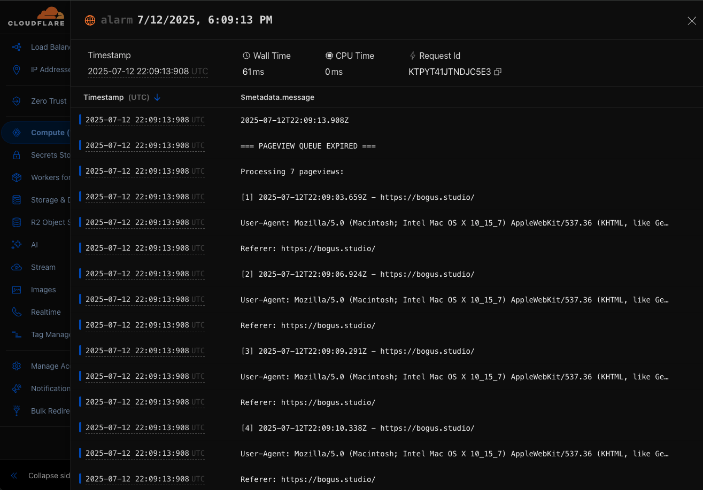
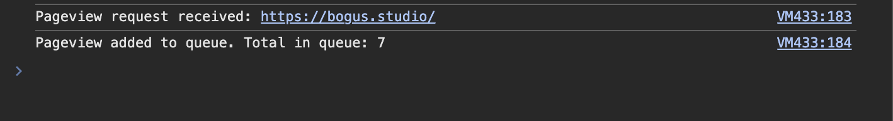

# Zaraz Managed Component Bindings Demo

This is a demo of using Cloudflare Durable Objects within Zaraz Managed Components. This is a new capability introduced in [cloudflare/managed-component-to-cloudflare-worker/pull/28](https://github.com/cloudflare/managed-component-to-cloudflare-worker/pull/28).

## How to Try It

To try it yourself, clone with repo and install dependencies by running `npm install`. Then check the status of [this PR](https://github.com/cloudflare/managed-component-to-cloudflare-worker/pull/28). If unmerged and/or not published to npm, you will need to clone [mackenly/managed-component-to-cloudflare-worker/tree/adds-durable-object-support](https://github.com/mackenly/managed-component-to-cloudflare-worker/tree/adds-durable-object-support). From within that repo's directory, run `npm install` to install its dependencies. Assuming both this repo and the MC to Worker repos are under the same parent directory, run the following replacing any paths as necessary from within the MC to Worker repo's directory:
```bash
./bin/managed-component-to-cloudflare-worker.js ../zaraz-managed-component-bindings-demo/dist/index.js custom-mc-bindings-demo ../zaraz-managed-component-bindings-demo/wrangler.toml
```

## What Does It Do

We're using a Durable Object to queue pageviews for later processing. The Durable Object is configured to process the queue 10 seconds after a pageview is received. If pageviews are received in bursts, this will prevent spamming a hypothetical analytics API with requests. This is a super simple example, but it demonstrates the capability.

After 10 seconds, the Worker logs the pageviews in the queue:


A console log is sent to the client's browser and executed to show the queue length and status:


## Hire Me

- [Consulting and training for Cloudflare and Zaraz](https://tricitiesmediagroup.com/contact)
- [X](https://x.com/mackenlyjones)
- [LinkedIn](https://www.linkedin.com/in/mackenly/)

## 📝 License

Licensed under the [Apache License](./LICENSE).
